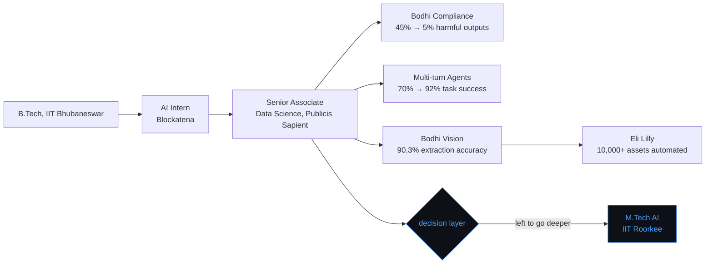

<div align="center">

```
model: purvi-verma
type:  applied-ai-engineer · 2+ yrs production LLM systems
```


</div>

<br>

## model card: `purvi-verma`

> Applied AI engineer who spent two years shipping LLM safety systems, multi-agent pipelines, and multimodal CV+LLM tooling into production at enterprise scale. Left the role to re-train from checkpoint — currently an M.Tech candidate in AI at IIT Roorkee.

<br>

### summary

```yaml
base_model:      B.Tech, IIT Bhubaneswar (CGPA 8.2/10)
fine-tuned_at:   Publicis Sapient — Senior Associate, Data Science (Jul 2024 – Jul 2026)
pre-training:    AI Intern, Blockatena (Mar 2023 – May 2023)
currently:       M.Tech, Artificial Intelligence — IIT Roorkee (2026 – 2028)
stack:           LangChain · LangGraph · RAG · MCP · vLLM · LoRA/PEFT
status:          in production for 2+ years, now training on harder problems
```

<br>

### deployments

**Bodhi Compliance — LLM safety guardrails**
Enterprise LLM deployments were producing non-compliant outputs at scale. Architected safety guardrails that cut harmful output rates from **45% → under 5%**.

**Multi-turn agent orchestration**
Single-turn LLM interactions couldn't handle complex enterprise workflows. Designed a context-aware, tool-calling agent that raised task success rate from **70% → 92%** and enabled systematic A/B testing across model variants.

**Bodhi Vision — multimodal CV + LLM pipeline**
Document processing for enterprise digital assets was fully manual. Built an end-to-end pipeline (format conversion, vLLM-powered segmentation, text detection) hitting **90.3% extraction accuracy**, **87% semantic consistency**, and **zero failures across 500+ assets** — replacing manual review entirely.

**Eli Lilly — regulated pharma content at scale**
Scaled the CV + LLM pipeline into a compliance-sensitive pharmaceutical environment, automating processing of **10,000+ assets** with high accuracy in a domain where errors aren't an option.

<br>

### architecture



<br>

### capabilities

<table>
<tr><td width="150"><b>genAI stack</b></td><td>LangChain · LangGraph · RAG · MCP · vLLM · FAISS/Pinecone/Chroma</td></tr>
<tr><td><b>fine-tuning</b></td><td>LoRA · PEFT · prompt engineering · model evaluation & benchmarking</td></tr>
<tr><td><b>ml platforms</b></td><td>Vertex AI (Gemini) · Azure AI · MLflow — experiment tracking, model registry, A/B testing</td></tr>
<tr><td><b>frameworks</b></td><td>PyTorch · TensorFlow · Hugging Face · DeepSpeed (distributed training)</td></tr>
<tr><td><b>mlops/llmops</b></td><td>Docker · Kubernetes · CI/CD · model monitoring · retraining workflows</td></tr>
<tr><td><b>languages</b></td><td>Python · C++ · Julia · SQL</td></tr>
</table>

<br>

### open source

**[`safeguard_toolkit`](https://pypi.org/project/safeguard_toolkit/)** — `pip install safeguard_toolkit`
A modular Python security scanner with 4 composable scanners for hardcoded secrets, risky configs, vulnerable dependencies, and unsafe file permissions. Entropy-based secret detection, dependency parsing across requirements.txt/Pipfile/pyproject.toml, CI/CD-ready plugin support.

**CodeMap** — AI-powered code architecture analyzer
A 7-stage pipeline combining static analysis with LLM reasoning to auto-generate architecture diagrams, dependency graphs, and docs from any repo. Batched summarization (10 functions/call), automated design-pattern detection, and self-healing Mermaid diagrams — an LLM repairs invalid syntax before render. Full analysis in under 5 minutes.

**contributions** — `google/bespoke` (error handling & API key resolution) · `video-keyframe-detector` (structured logging, core bug fixes) · `CRAFT-pytorch` (PyTorch/torchvision compatibility, CUDA/CPU fallback)

<br>

### benchmarks

| eval | result |
|---|---|
| Google Cloud Agentic AI Day Hackathon | **Top 700 / 9,100 teams** — AgriBot, a multimodal AI assistant for Indian farmers |
| Real-time Age & Gender Detection | **1st place**, IIT Bhubaneswar Hackathon (2023) |
| B.Tech, IIT Bhubaneswar | CGPA 8.2/10 |
| Class XII, CBSE | 92.2% |


### inference example

```bash
$ curl -X POST https://api.purvi-verma.dev/v1/connect \
    -H "Content-Type: application/json" \
    -d '{"intent": "collaborate"}'
```

```json
{
  "response": "always open to it",
  "endpoints": {
    "linkedin":  "https://www.linkedin.com/in/purvi-verma-3a553a23b/",
    "portfolio": "https://purvi1508.github.io/PurviVerma/",
    "leetcode":  "https://leetcode.com/u/20ce01050/",
    "email":     "purviverma2026@gmail.com"
  }
}
```

<br>

<div align="center">

`languages: Python · C++ · Julia · SQL` &nbsp;·&nbsp; `last updated: 2026` &nbsp;·&nbsp; `license: open to collaboration`

</div>
